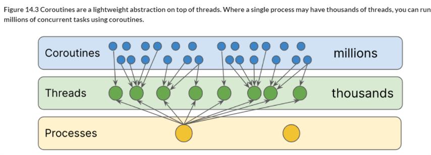

# ¿Qué son las corrutinas?

En términos simples, las **corrutinas** son una forma de **escribir código asíncrono** que se ejecuta de manera secuencial. Esto significa que puedes escribir código que parece ejecutarse en orden, pero en realidad, ciertas partes del código pueden ejecutarse en segundo plano sin bloquear la aplicación.

Con las **corrutinas**, puedes escribir código asíncrono, que se ha escrito tradicionalmente usando el patrón Callback, pero utilizando estilo síncrono

## Por qué son importantes las corrutinas en Android?

### Evitar bloqueos

* Las tareas largas (como descargar datos de una red) pueden bloquear la interfaz de usuario si se ejecutan en el hilo principal. Las corrutinas permiten ejecutar estas tareas en segundo plano, manteniendo la interfaz fluida y responsiva.

###  Simplificar el código

* El código asíncrono tradicional puede ser complejo y difícil de entender, con callbacks anidados. Las corrutinas ofrecen una sintaxis más sencilla y legible.

### Mejorar el rendimiento

* Al distribuir las tareas entre diferentes hilos, puedes aprovechar al máximo los recursos del dispositivo y mejorar el rendimiento general de tu aplicación.

# Qué son las corrutinas...

* En términos simples, las corrutinas son una forma de escribir código asíncrono que se ejecuta de manera secuencial. Esto significa que puedes escribir código que parece ejecutarse en orden, pero en realidad, ciertas partes del código pueden ejecutarse en segundo plano sin bloquear la aplicación.

* Con las corrutinas, puedes escribir código asíncrono, que se ha escrito tradicionalmente usando el patrón Callback, pero utilizando estilo síncrono

* Para entender fácilmente las corrutinas, digamos que las **corrutinas son como hilos, pero mejores**

* Primero, porque las corrutinas **te permiten escribir tu código asíncrono de forma secuencial,** lo que reduce drásticamente la carga cognitiva

* Y segundo, porque son mucho más eficientes.**Varias corrutinas se pueden ejecutar utilizando el mismo hilo.** Por tanto, mientras que el número de hilos que se pueden ejecutar en una aplicación es bastante limitado, se pueden lanzar tantas corrutinas como se necesite. El límite es casi infinito

* Las corrutinas se basan en la idea de las ***funciones de suspensión***. Estas son funciones que pueden detener la ejecución de una corrutina en cualquier punto y luego devolverle el control una vez que el resultado esté listo y la función haya terminado de hacer su trabajo

* Por lo tanto, las corrutinas son básicamente un ***lugar seguro donde las funciones de suspensión (normalmente) no bloquean el hilo principal***

# Prueba desde Jota2 GitHub Colaborativo
* Añadiendo comentarios del README.md
---------------------